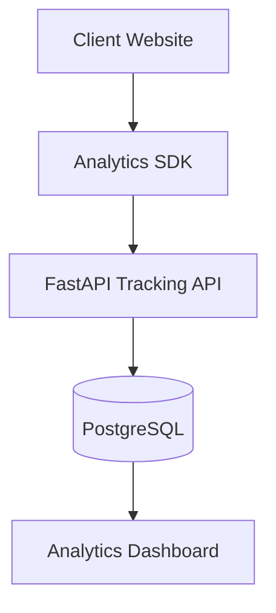

# Architecture

## Backend flow

- The SDK posts events to `POST /api/events/track`.
- FastAPI validates the request with Pydantic.
- SQLAlchemy persists events and users to PostgreSQL.
- Analytics endpoints aggregate event counts for dashboard rendering.

## Frontend flow

- The dashboard fetches overview data, funnel counts, and paginated events.
- Recharts renders the funnel visualization.
- Tailwind CSS provides the visual shell and responsive layout.
